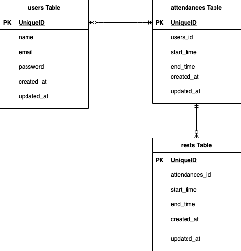

## アプリケーション名

Atte(アット)

## アプリケーション概要

ある企業の勤怠管理システムです。

## URL

http://pure-caverns-88245.herokuapp.com/

## 利用方法

-   会員登録：名前、メールアドレス、パスワードを登録します。
-   登録したメールアドレスへ「メールアドレスの確認」メールが届くので、そのメール内にある「メールアドレスの確認」ボタンをクリックしていただくことでご利用いただける様になります。
-   ログインにはメールアドレスとパスワードが必要です。
-   パスワードをお忘れの際は、ログイン画面の「パスワードをお忘れの方はこちら」からパスワードの再設定ができます。
-   その後の画面で登録したメールアドレスを入力後、「パスワードの再設定リンクの送信」ボタンをクリックすると、そのメールアドレス宛に「パスワードの再設定通知メール」が届きます。
-   メールが届いてから 60 分以内に「パスワードの再設定」ボタンをクリックしていただくとパスワードの再設定画面が表示されるので、必要事項を入力後、「パスワードの再設定」をクリックするとパスワードの再設定が完了します。
-   パスワードの再設定後、ログイン画面が表示されるので必要事項を入力してログインいただけます。
-   ログイン中、右上の「ログアウト」をクリックするとログアウトします。
-   ホーム画面:現在の状況に合わせて、勤務開始、勤務終了、休憩開始、休憩終了の各ボタンをクリックします。
-   日付一覧ページ:該当日付における出勤状況の一覧を確認できます。
-   勤怠一覧ページ:ログイン中のユーザーの出勤状況の一覧を確認できます。

## 目指した課題解決

勤務状況の確認を人事評価に活用します。

## ページ

| パス            | 内容             |
| --------------- | ---------------- |
| /               | 打刻ページ       |
| /register       | 会員登録ページ   |
| /login          | ログインページ   |
| /attendance     | 日付別勤怠ページ |
| /userattendance | ユーザーページ   |

## 要件定義

| No. | 機能 | 目的 | 内容 |
| --- | ---- | ---- | ---- |
| 1   | 設計 | 目的 | 詳細 |

| 2 | 会員登録機能 | 会員登録することでメール認証機能が利用できるようになります。 | 名前、メールアドレス、パスワードを登録します。 |

| 3 | メール認証機能 | メール認証をすることで各種機能を使用可能となります。 | 会員登録したメールアドレスへ送られてきたメール内のボタンをクリックすることでメール認証が完了します。 |

| 4 | パスワード再設定機能 | パスワードをお忘れの際に、再設定できます。 | ログイン画面から「パスワードをお忘れの方はこちら」をクリック後、メール認証機能同様の手続きでパスワードの再設定をします。 |

| 5 | ログイン、ログアウト機能 | 登録墨会員のみ利用可能です。 | メールアドレスとパスワードが必要です。 |

| 6 | 勤務開始、勤務終了 | 勤務開始、勤務終了時刻の記録及び勤務時間の計算に使用します。 | 勤務中でなければ勤務開始ボタンのみ押せる様になっており、勤務終了ボタンは勤務中のみ押せる様になっています。勤務終了後であれば、同じ日でも再び勤務開始ボタンを押すことはできます。出勤した時点を基準として関連する時刻データが記録されますので、出勤している状態で日を跨いだ場合、その日最初の操作では勤務開始ボタンは押せない様になっています。 |

| 7 | 休憩開始、休憩終了 | 休憩開始、休憩終了時刻の記録及び休憩時間の計算に使用します。 | 休憩開始ボタン、休憩終了ボタンは勤務中のみ押せる様になっています。一度の出勤内では何度でも休憩することが可能です。休憩中でなければ休憩開始ボタンのみ押せる様になっており、休憩中であれば休憩終了ボタンのみ押せる様になっています。 |

| 8 | 日付別勤怠情報取得 | 特定日付における 1 出勤毎に、会員名と勤務開始及び勤務終了時刻、休憩時間、勤務時間を表示します。 | 休憩時間は 1 出勤記録内における総休憩時間を示し、勤務時間は 1 出勤記録内における総休憩時間を除いた総時間を示します。出勤した時点を基準として関連する時刻データが記録されますので、出勤している状態で日を跨いだ出勤記録は勤務開始ボタンを押した日のものとして扱っています。そのため、表示上は勤務開始時刻よりも勤務終了時刻が先になることがあり得ます。 |

| 9 | ユーザー別勤怠情報取得 | ログイン中のユーザーにおける 1 出勤毎に、勤務開始日と勤務開始及び勤務終了時刻、休憩時間、勤務時間を表示します。 | 休憩時間は 1 出勤記録内における総休憩時間を示し、勤務時間は 1 出勤記録内における総休憩時間を除いた総時間を示します。出勤した時点を基準として関連する時刻データが記録されますので、出勤している状態で日を跨いだ出勤記録は勤務開始ボタンを押した日のものとして扱っています。そのため、表示上は勤務開始時刻よりも勤務終了時刻が先になることがあり得ます。 |

| 10 | ページネーション | 目的 | 特定日付における勤務情報を 5 件ずつ表示します。 |

| 11 | 現在の状況表示 | 現在勤務中か、休憩中かが分かる様に表示されます。 | 勤務中であれば「勤務中です。」勤務中でなければ「勤務中ではありません。」、休憩中であれば「休憩中です。」、休憩中でなければ「休憩中ではありません。」が表示されます。勤務中の場合は休憩との組み合わせで表示されますが、勤務中でない場合は「勤務中ではありません。」のみが表示されます。 |

## データベース設計

## 開発環境

| 名称          | バージョン   |
| ------------- | ------------ |
| Composer      | 2.1.3        |
| Laravel       | 8.58.0       |
| MySQL         | 5.7.32       |
| PHP           | 7.4.21       |
| Google Chrome | 96.0.4664.55 |

## 動作確認済み

| PC/SP | 名称          | バージョン        |
| ----- | ------------- | ----------------- |
| PC    | Google Chrome | 96.0.4664.55      |
| PC    | Safari        | 15.1              |
| PC    | Firefox       | 94.0.1(64 ビット) |
| SP    | iOS           | 15.1              |

## 環境構築手順

### Composer のインストール方法

-   Mac の場合

[こちら](https://getcomposer.org/download/)から Composer の Web サイトに移動し、ページの下部にある Manual Download から 2.〇.〇の最新バージョンのリンクをクリックしてください。  
これで「ダウンロード」フォルダに「composer.phar」というファイルがダウンロードされます。  
続いてターミナルを起動後、Download ディレクトリに移動し以下のコマンドを実行します。  
`cd Downloads`  
`sudo mv composer.phar /usr/local/bin/composer`  
`chmod a+x /usr/local/bin/composer`

-   Windows の場合
    [こちら](https://getcomposer.org/doc/00-intro.md#installation-windows)から Composer の Web サイトに移動します。  
    「Installation – Windows の Using the Installer」の文章中に「Composer-Setup.exe」というリンクがあるのでインストーラをダウンロードしてください。  
    ダウンロードしたインストーラを起動します。  
    起動すると画面に「Developer mode」というチェックボックスが表示された画面が現れるので OFF のまま次に「Next」をクリックします。  
    使用する PHP を設定する画面です。XAMPP の PHP を選択して次に進んでください。  
    Settings Check では「C:¥xampp¥php¥php.exe」を選択し「Next」をクリックします。  
    インストール画面まで「Next」を選択し、インストール画面では「Install」を選択します。  
    その後「Finish」ボタンを押したらインストール完了です。

## GitHub から Clone(Mac で MySQL を使用している場合の例)

`cd /Applications/MAMP/htdocs/Atte`

`git clone https://github.com/makoto-0358/20210918_Advance_Atte.git`

`cd 20210918_Advance_Atte`

`composer install`

`cp .env.example .env`

`php artisan key:generate`

`php artisan config:clear`

## データベース作成(Mac で MySQL を使用している場合の例)

`cd /Applications/MAMP/Library/bin`
`./mysql -u root -p`
`CREATE DATABASE attedb;`

## .env の設定(Mac で MySQL を使用している場合の例)

`DB_CONNECTION=mysql`

`DB_HOST=127.0.0.1`

`DB_PORT=3306`

`DB_DATABASE=atteddb`

`DB_USERNAME=root`

`DB_PASSWORD=root`

## データベース作成後

`php artisan serve`

`php artisan migrate`
