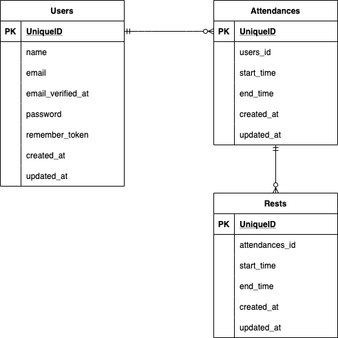

## アプリケーション名

Atte(アット)

## アプリケーション概要

ある企業の勤怠管理システムです。

## URL

http://pure-caverns-88245.herokuapp.com/

## 利用方法

-   会員登録：名前、メールアドレス、パスワードを登録します。
-   登録後のログイン時はメールアドレスとパスワードでログインします。
-   ログイン中、右上の「ログアウト」をクリックするとログアウトします。
-   ホーム画面:現在の状況に合わせて、勤務開始、勤務終了、休憩開始、休憩終了の各ボタンをクリックします。
-   日付一覧ページ:該当日付における出勤状況の一覧を確認できます。

## 目指した課題解決

勤務状況の確認を人事評価に活用します。

## ページ

| パス        | 内容             |
| ----------- | ---------------- |
| /           | 打刻ページ       |
| /register   | 会員登録ページ   |
| /login      | ログインページ   |
| /attendance | 日付別勤怠ページ |

## 要件定義

| No. | 機能                     | 目的                                                                                            | 内容                                                                                                                                                                                                                                                                                                                                                   |
| --- | ------------------------ | ----------------------------------------------------------------------------------------------- | ------------------------------------------------------------------------------------------------------------------------------------------------------------------------------------------------------------------------------------------------------------------------------------------------------------------------------------------------------ |
| 1   | 設計                     | 目的                                                                                            | 詳細                                                                                                                                                                                                                                                                                                                                                   |
| 2   | 会員登録機能             | 登録した会員のみが使用可能となります。                                                          | 名前、メールアドレス、パスワードを登録します。                                                                                                                                                                                                                                                                                                         |
| 3   | ログイン、ログアウト機能 | 登録墨会員のみ利用可能とします。                                                                | メールアドレスとパスワードが必要です。                                                                                                                                                                                                                                                                                                                 |
| 4   | 勤務開始、勤務終了       | 勤務開始、勤務終了時刻の記録及び勤務時間の計算に使用します。                                    | 勤務中でなければ勤務開始ボタンのみ押せる様になっており、勤務終了ボタンは勤務中のみ押せる様になっています。勤務終了後であれば、同じ日でも再び勤務開始ボタンを押すことはできます。出勤した時点を基準として関連する時刻データが記録されますので、出勤している状態で日を跨いだ場合、その日最初の操作では勤務開始ボタンは押せない様になっています。         |
| 5   | 休憩開始、休憩終了       | 休憩開始、休憩終了時刻の記録及び休憩時間の計算に使用します。                                    | 休憩開始ボタン、休憩終了ボタンは勤務中のみ押せる様になっています。一度の出勤内では何度でも休憩することが可能です。休憩中でなければ休憩開始ボタンのみ押せる様になっており、休憩中であれば休憩終了ボタンのみ押せる様になっています。                                                                                                                     |
| 6   | 日付別勤怠情報取得       | 特定日付における 1 出勤毎に、会員名と勤務開始及び勤務終了時刻、休憩時間、勤務時間を表示します。 | 休憩時間は 1 出勤記録内における総休憩時間を示し、勤務時間は 1 出勤記録内における総休憩時間を除いた総時間を示します。出勤した時点を基準として関連する時刻データが記録されますので、出勤している状態で日を跨いだ出勤記録は勤務開始ボタンを押した日のものとして扱っています。そのため、表示上は勤務開始時刻よりも勤務終了時刻が先になることがあり得ます。 |
| 7   | ページネーション         | 目的                                                                                            | 特定日付における勤務情報を 5 件ずつ表示します。                                                                                                                                                                                                                                                                                                        |
| 8   | 現在の状況表示           | 現在勤務中か、休憩中かが分かる様に表示されます。                                                | 勤務中であれば「勤務中です。」勤務中でなければ「勤務中ではありません。」、休憩中であれば「休憩中です。」、休憩中でなければ「休憩中ではありません。」が表示されます。勤務中の場合は休憩との組み合わせで表示されますが、勤務中でない場合は「勤務中ではありません。」のみが表示されます。                                                                 |

## データベース設計

## 開発環境

| 名称          | バージョン   |
| ------------- | ------------ |
| Laravel       | 8.58.0       |
| MySQL         | 5.7.32       |
| PHP           | 7.4.21       |
| Google Chrome | 96.0.4664.55 |

## 動作確認済み

| PC/SP | 名称          | バージョン        |
| ----- | ------------- | ----------------- |
| PC    | Google Chrome | 96.0.4664.55      |
| PC    | Safari        | 15.1              |
| PC    | Firefox       | 94.0.1(64 ビット) |
| SP    | iOS           | 15.1              |
